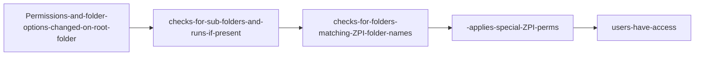

 


# Egnyte Permissions and the issue therein

Egnyte's GUI only allows for limited options to change permissions and folder options. Egnyte also locks the ability to move and delete folders to Admins, Owners, and users with full permissions, however this option has to be enabled on EACH sub-folder in order for a user to move/delete a folder. For some project folders, there are hundreds of sub-folders that would all need to be touched, and this process could take hours.

## What is the solution

Enter this application. This simple web app will dynamically parse through all folders of the given root folder, and run the API call to fix the permissions. After this app has ran and made the necessary changes, the user will be able to move/delete the requested folder

### Using the app

A user should give you the full name of the folder in question. For example, "Y:/Albany, NY - Lincoln Park - 12914". Enter the full folder name and choose the directory that this folder lives in (Projects, Restoration & Maintenance), then submit

### How it works



### Behing the scenes

There is a separate function for each part of the permission changing process.

First, the Permissions required for ALL folders are set:

```javascript
// Sets permissions
export async function setPerms(path) {
  try {
    const reqURL = permURL + path;
    const req = await axios.post(reqURL, data, { headers });
    if (req.status === 204) {
      console.log(`Folder ${path} permissions changed succesfully`);
    } else {
      console.log("error changing permissions");
    }
  } catch (err) {
    console.log("error setting permissions", err);
  }
}
```

```javascript
// Perms that should be set on all folders
const data = JSON.stringify({
  groupPerms: {
    "INT-ENGINEERING": "Full",
    "INT-ACCOUNTING": "Full",
    "INT-DESIGN": "Full",
    "INT-SALES": "Editor",
    "INT-PROJECT_MANAGEMENT": "Full",
    "INT-MANAGEMENT": "Full",
  },
});
```

Then, the folder options to allow full access users are set:

```javascript
// Sets move options
export async function setOptions(path) {
  try {
    const reqURL = fsURL + path;
    const req = await axios.patch(reqURL, options, { headers });
    if (req.status === 200) {
      console.log(`Folder options for ${path} change successfully`);
    } else {
      console.log("error changing options");
    }
  } catch (err) {
    console.log("error setting options", err);
  }
}
```

```javascript
// Enabled users with Full access to move items
const options = {
  restrict_move_delete: "false",
};
```

Lastly, the script checks if the name of the current folder matches a ZPI folder. If so, it sets the special permisisons:

```javascript
// Folders that require special permissions
const read_folders = ["6. Engineering", "7. Submittals & Approvals"];
const write_folders = ["12. Solidworks Files", "12. Solidworks files"];

// Read Perms
"ZPI-READ": "Viewer",
"ZPI-WRITE": "Viewer",

// Write Perms
"ZPI-READ": "Viewer",
"ZPI-WRITE": "Full",

// Set Zephyr Read permissions
export async function setZRead(path) {
  try {
    const reqURL = permURL + path;
    const req = await axios.post(reqURL, readPerms, { headers });
    if (req.status === 204) {
      console.log(`Z Read perms set on ${path}`);
    } else {
      console.log("error changing read perms");
    }
  } catch (err) {
    console.log("error setting Read permissions", err);
  }
}

// Set Zephyr Write permissions
export async function setZWrite(path) {
  try {
    const reqURL = permURL + path;
    const req = await axios.post(reqURL, writePerms, { headers });
    if (req.status === 204) {
      console.log(`Z Write perms set on ${path}`);
    } else {
      console.log("error changing read perms");
    }
  } catch (err) {
    console.log("error setting Write permissions", err);
  }
}
```

The script then checks to see there are any more folders, and if not, returns an array of all the folders modified. The full app with a rundown is below:

```javascript
// Touched files array populated with modified paths
export async function getFiles(path, touchedFiles = []) {
  try {
    // GET call on current folder
    const req = await axios.get(`${fsURL}${path}`, { headers });

    if (req.status !== 200) {
      console.log("there was an error fetching data", req.status);
      return;
    }

    const { data } = req;
    const { folders } = req.data;
    // Getting path to current folder
    const route = req.data.path;

    await setPerms(route);
    // Adding modified path to touchedFiles array
    touchedFiles.push(route);

    await setOptions(route);

    // Checking if any more folders exist. Exits if not
    if (!folders) {
      return touchedFiles;
    }

    // Iterates through list of sub-folders
    for (const folder of folders) {
      // Sets current folder iteration as new path for next pass
      const newPath = folder.path;
      const folderName = folder.name.trim();

      if (read_folders.includes(folderName)) {
        await setZRead(newPath);
      } else if (write_folders.includes(folderName)) {
        await setZWrite(newPath);
      }

      // Runs script again on sub-folder and passed touchedFiles array
      await getFiles(newPath, touchedFiles);
    }
  } catch (err) {
    console.log("caught error:", err);
    return;
  }
  // Returns array after all folders have finished
  return touchedFiles;
}
```
